  

  <em>Probably not the <code>@joa</code> you mentioned in your merge request.</em>

Distributed systems, compilers, and the occasional AI experiment. Former CTO at Make.TV, co-founder of [Audiotool](https://www.audiotool.com) and Defrac. Now working at LTN Global, contributing to a 99.9999% uptime environment for the broadcast industry.

### Selected work

| | Project | What it is | |
|:-:|---|---|---|
| 🌑 | [**phobos-lang**](https://github.com/joa/phobos-lang) | A tiny, scale-free GPU kernel language & very fast inference for older GPUs |  |
| 🚀 | [**overbounce**](https://github.com/joa/overbounce) | A browser 3D speedrunning game based on Quake III movement |  |
| 🎛️ | [**aion**](https://github.com/joa/aion) | A purely functional audio engine |  |
| ⚙️ | [**apparat**](https://github.com/joa/apparat) | A framework to optimize ABC, SWC and SWF files |  |
| ⚖️ | [**jawlb**](https://github.com/joa/jawlb) | A just-add-water load balancer for gRPC |  |
| 💓 | [**failuredetector**](https://github.com/joa/failuredetector) | A Phi accrual failure detector for Go |  |

### Elsewhere

  
  
  
  
  
  

